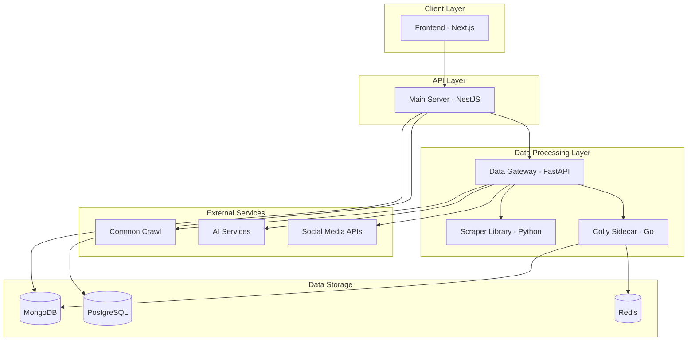

# PakSentiment

> A comprehensive social media sentiment analysis platform focused on Pakistani social discourse

[](https://opensource.org/licenses/MIT)
[](https://www.python.org/downloads/)
[](https://nodejs.org/)
[](https://golang.org/)

**Final Year Project (FYP) - AIR University**

---

## 📋 Table of Contents

- [Overview](#overview)
- [Features](#features)
- [Architecture](#architecture)
- [Tech Stack](#tech-stack)
- [Project Structure](#project-structure)
- [Getting Started](#getting-started)
- [Documentation](#documentation)
- [API Documentation](#api-documentation)
- [Team](#team)
- [License](#license)

---

## 🎯 Overview

PakSentiment is a full-stack sentiment analysis platform designed to analyze social media discourse in Pakistan. The system aggregates data from multiple sources (Reddit, Twitter, YouTube, web pages, and Common Crawl), performs AI-powered sentiment classification with multi-language support (Urdu and English), and provides comprehensive analytics through an intuitive dashboard.

The platform serves as a middleware layer connecting a modern frontend application to a sophisticated data gateway and AI services, ensuring a complete pipeline from data collection to advanced analytics and visualization.

### Key Capabilities

- **Multi-Source Data Collection**: Aggregate data from Reddit, Twitter, YouTube, web pages, and historical Common Crawl archives
- **AI-Powered Analysis**: Leverage multiple AI engines (Ollama, Groq, HuggingFace) for sentiment classification
- **Multi-Language Support**: Automatic language detection and translation for Urdu and English content
- **Smart Search**: AI-driven multi-source search planning for comprehensive analysis
- **Real-Time Analytics**: Interactive dashboard with KPIs, sentiment breakdowns, and topic analysis
- **Secure Authentication**: JWT-based authentication with OAuth (Google) support
- **Export Capabilities**: Export analysis results for further processing

---

## ✨ Features

### Data Collection
- **Reddit Integration**: Fetch posts and comments from specific subreddits
- **Twitter/X Integration**: Collect tweets based on queries and hashtags
- **YouTube Scraping**: Extract videos, comments, and transcripts
- **Web Scraping**: Stealthy scraping with Scrapling and high-performance Colly crawler
- **Common Crawl**: Access historical web data from Common Crawl archives
- **Smart AI Search**: Multi-source intelligent search planning

### Analysis & Processing
- **Sentiment Classification**: Positive, Negative, and Neutral sentiment detection
- **Confidence Scoring**: AI confidence levels for each classification
- **Topic Detection**: Automatic topic extraction and categorization
- **Multi-Language Support**: Urdu and English language detection and translation
- **Chunk-Based Analysis**: Process large content in manageable chunks
- **Rate Limiting**: Automatic retry logic for high-volume requests

### User Interface
- **Interactive Dashboard**: Real-time analytics and visualizations
- **KPI Metrics**: Total documents, unique authors, top topics, average confidence
- **Sentiment Breakdown**: Visual representation of sentiment distribution
- **Export Functionality**: Download analysis results
- **Session Management**: Track and retrieve analysis sessions
- **Responsive Design**: Modern, mobile-friendly interface

### Security & Authentication
- **JWT Authentication**: Secure token-based authentication
- **OAuth Integration**: Google OAuth support
- **Password Management**: Secure password reset functionality
- **Role-Based Access**: User authorization and access control

---

## 🏗️ Architecture

PakSentiment employs a microservices architecture with clear separation of concerns:



### Component Overview

| Component | Technology | Purpose |
|-----------|-----------|---------|
| **Frontend** | Next.js, React, TypeScript | User interface and visualization |
| **Main Server** | NestJS, TypeScript | Authentication, API gateway, business logic |
| **Data Gateway** | FastAPI, Python | Data aggregation, AI orchestration |
| **Colly Sidecar** | Go, Colly | High-performance web crawling |
| **Scraper Library** | Python, asyncio | Multi-platform data scraping |
| **PostgreSQL** | SQL Database | User data and configuration |
| **MongoDB** | NoSQL Database | Posts, analytics, and crawl results |
| **Redis** | Cache | Page caching and session management |

---

## 🛠️ Tech Stack

### Frontend
- **Framework**: Next.js 14+ with App Router
- **Language**: TypeScript
- **UI Library**: React 18+
- **Styling**: Tailwind CSS / CSS Modules
- **State Management**: React Hooks
- **HTTP Client**: Axios / Fetch API

### Backend - Main Server
- **Framework**: NestJS
- **Language**: TypeScript
- **Authentication**: JWT, Passport.js, OAuth 2.0
- **ORM**: TypeORM / Prisma
- **API Documentation**: Swagger/OpenAPI
- **Validation**: class-validator

### Backend - Data Gateway
- **Framework**: FastAPI
- **Language**: Python 3.12+
- **Async Runtime**: asyncio, httpx
- **Data Validation**: Pydantic, msgspec
- **Configuration**: Dynaconf
- **Scraping**: Scrapling, BeautifulSoup, jusText

### Backend - Colly Sidecar
- **Language**: Go 1.21+
- **Framework**: Gin / Fiber
- **Scraping**: Colly
- **Content Extraction**: go-readability

### Databases & Cache
- **PostgreSQL 16**: User authentication and configuration
- **MongoDB 7**: Posts, analytics, and crawl data
- **Redis 7**: Caching and session storage

### AI & ML Services
- **Ollama**: Local LLM inference
- **Groq**: Cloud-based LLM API
- **HuggingFace**: Pre-trained models and transformers

### DevOps & Deployment
- **Containerization**: Docker, Docker Compose
- **Package Management**: npm/yarn (Node.js), uv/pip (Python), go mod (Go)
- **Version Control**: Git, GitHub
- **CI/CD**: GitHub Actions

---

## 📁 Project Structure

```
paksentiment/
├── frontend/                      # Next.js frontend application
│   ├── src/
│   │   ├── app/                  # App router pages
│   │   ├── components/           # React components
│   │   ├── hooks/                # Custom React hooks
│   │   └── types/                # TypeScript type definitions
│   ├── public/                   # Static assets
│   └── Dockerfile
│
├── main-server/                   # NestJS main server
│   ├── src/
│   │   ├── auth/                 # Authentication module
│   │   ├── users/                # User management
│   │   ├── raw-data/             # Data proxy endpoints
│   │   └── swagger.ts            # API documentation
│   ├── test/                     # E2E tests
│   └── Dockerfile
│
├── new PakSentiment-data-gateway/ # FastAPI data gateway
│   ├── services/
│   │   ├── scrapling_service.py  # Web scraping service
│   │   ├── reddit_service.py     # Reddit integration
│   │   ├── twitter_service.py    # Twitter integration
│   │   └── youtube_service.py    # YouTube integration
│   ├── models/                   # Data models
│   └── Dockerfile
│
├── colly-sidecar/                 # Go web crawler
│   ├── cmd/                      # Command entry points
│   ├── crawler/                  # Crawler logic
│   │   ├── crawler.go
│   │   ├── extractor.go
│   │   ├── readability.go
│   │   └── scrapling.go
│   ├── cache/                    # Redis cache integration
│   └── Dockerfile
│
├── PakSentiment-scraper/          # Python scraper library
│   ├── src/paksentiment_scraper/
│   │   ├── youtube_service.py
│   │   ├── reddit_service.py
│   │   ├── twitter_service.py
│   │   ├── commoncrawl_service.py
│   │   ├── scrapling_service.py
│   │   └── models.py
│   └── pyproject.toml
│
├── architecture/                  # Architecture documentation
│   ├── class-diagram.md
│   ├── data-schema.md
│   └── scraper-library-diagram.md
│
├── docs/                         # Additional documentation
├── docker-compose.yml            # Docker orchestration
├── pyproject.toml                # Python workspace config
└── Project WIKI.md               # Comprehensive project wiki
```

---

## 🚀 Getting Started

### Prerequisites

- **Node.js** 18+ and npm/yarn
- **Python** 3.12+
- **Go** 1.21+
- **Docker** and Docker Compose (for containerized deployment)
- **PostgreSQL** 16+
- **MongoDB** 7+
- **Redis** 7+

### Local Development Setup

#### 1. Clone the Repository

```bash
git clone https://github.com/MRGLOBIN/FYP-Paksentiment.git
cd FYP-Paksentiment
```

#### 2. Environment Configuration

Create `.env` files based on the provided examples:

```bash
# Root directory
cp .env.docker.example .env.docker

# Main Server
cp main-server/.env.example main-server/.env

# Frontend
cp frontend/.env.example frontend/.env
```

Configure the following environment variables:

**Main Server (.env)**
```env
PORT=3000
NODE_ENV=development
POSTGRES_HOST=localhost
POSTGRES_PORT=5432
POSTGRES_USER=paksentiment
POSTGRES_PASSWORD=your_password
POSTGRES_DB=paksentiment
MONGO_URI=mongodb://localhost:27017
MONGO_DB=paksentiment
REDIS_URL=redis://localhost:6379
FAST_API_BASE_URL=http://localhost:8000
COLLY_SIDECAR_URL=http://localhost:8081
OLLAMA_URL=http://localhost:11434
JWT_SECRET=your_jwt_secret
JWT_EXPIRES_IN=1h
```

**Data Gateway**
Configure API keys in `new PakSentiment-data-gateway/config/.secrets.toml`:
```toml
[default]
YOUTUBE_API_KEY = "your_youtube_api_key"
REDDIT_CLIENT_ID = "your_reddit_client_id"
REDDIT_CLIENT_SECRET = "your_reddit_client_secret"
TWITTER_BEARER_TOKEN = "your_twitter_bearer_token"
```

#### 3. Install Dependencies

**Frontend**
```bash
cd frontend
npm install
# or
yarn install
```

**Main Server**
```bash
cd main-server
npm install
# or
yarn install
```

**Data Gateway & Scraper Library**
```bash
# Install uv (Python package manager)
curl -LsSf https://astral.sh/uv/install.sh | sh

# Install dependencies
uv sync
```

**Colly Sidecar**
```bash
cd colly-sidecar
go mod tidy
```

#### 4. Start Databases

**Using Docker**
```bash
docker-compose up postgres mongo redis -d
```

**Or install locally** (PostgreSQL, MongoDB, Redis)

#### 5. Run Services

**Terminal 1 - Data Gateway**
```bash
cd "new PakSentiment-data-gateway"
uv run uvicorn main:app --reload --port 8000
```

**Terminal 2 - Colly Sidecar**
```bash
cd colly-sidecar
go run main.go
```

**Terminal 3 - Main Server**
```bash
cd main-server
npm run start:dev
```

**Terminal 4 - Frontend**
```bash
cd frontend
npm run dev
```

#### 6. Access the Application

- **Frontend**: http://localhost:3001
- **Main Server API**: http://localhost:3000
- **API Documentation**: http://localhost:3000/api
- **Data Gateway**: http://localhost:8000
- **Colly Sidecar**: http://localhost:8081

### Docker Deployment

For a complete containerized deployment:

```bash
# Build and start all services
docker-compose up --build

# Run in detached mode
docker-compose up -d

# View logs
docker-compose logs -f

# Stop all services
docker-compose down
```

**Service Ports (Docker)**
- Frontend: http://localhost:5001
- Main Server: http://localhost:5002
- Data Gateway: http://localhost:5003
- Colly Sidecar: http://localhost:5004
- PostgreSQL: localhost:5005
- MongoDB: localhost:5006
- Redis: localhost:5007

---

## 📚 Documentation

Comprehensive documentation is available in the repository:

- **[Project WIKI](./Project%20WIKI.md)**: Complete system documentation with architecture details, API references, and implementation guides
- **[Architecture Diagrams](./architecture/)**: Class diagrams, data schemas, and system architecture
- **[Scraper Library](./PakSentiment-scraper/README.md)**: Documentation for the Python scraper library
- **[Colly Sidecar](./colly-sidecar/README.md)**: Go crawler service documentation

### Key Documentation Sections

The [Project WIKI](./Project%20WIKI.md) includes:

1. **Project Introduction**: Overview and system architecture
2. **Main Server Architecture**: NestJS backend details
3. **Data Gateway Architecture**: FastAPI service documentation
4. **Crawler Sidecar Architecture**: Go Colly implementation
5. **Sentiment Analysis Pipeline**: AI integration and processing
6. **User Authentication & Management**: Security implementation
7. **Data Collection Mechanisms**: Multi-source data aggregation
8. **Database Schemas & Storage**: Data models and storage strategy
9. **Analytics Dashboard & UI**: Frontend implementation
10. **AI Models & Services**: AI service integration
11. **Local Development & Deployment**: Setup and deployment guides

---

## 📖 API Documentation

### Interactive API Documentation

The Main Server provides interactive Swagger/OpenAPI documentation:

**URL**: http://localhost:3000/api (or http://localhost:5002/api in Docker)

### Authentication

Most endpoints require JWT authentication. Obtain a token by:

1. **Register**: `POST /auth/register`
2. **Login**: `POST /auth/login-with-email-password`
3. **OAuth**: `POST /auth/google` (Google OAuth)

Include the token in subsequent requests:
```
Authorization: Bearer <your_jwt_token>
```

### Key Endpoints

#### Authentication
- `POST /auth/register` - Register new user
- `POST /auth/login-with-email-password` - Login with credentials
- `POST /auth/forgot-password` - Request password reset
- `POST /auth/google` - Google OAuth login

#### Data Collection & Analysis
- `POST /raw-data/reddit/sentiment` - Analyze Reddit data
- `POST /raw-data/twitter/sentiment` - Analyze Twitter data
- `POST /raw-data/web` - Analyze web pages
- `POST /raw-data/smart` - AI-powered multi-source search
- `GET /raw-data/session/:sessionId` - Retrieve analysis session

#### Health & Monitoring
- `GET /` - API health check
- `GET /health` - Service health status

### Example Request

```bash
# Login
curl -X POST http://localhost:3000/auth/login-with-email-password \
  -H "Content-Type: application/json" \
  -d '{
    "email": "user@example.com",
    "password": "your_password"
  }'

# Analyze Reddit sentiment
curl -X POST http://localhost:3000/raw-data/reddit/sentiment \
  -H "Authorization: Bearer <your_token>" \
  -H "Content-Type: application/json" \
  -d '{
    "subreddit": "pakistan",
    "query": "politics",
    "limit": 50
  }'
```

---

## 👥 Team

This project was developed as a Final Year Project (FYP) at **AIR University** by a dedicated team of students.

### Contributors

- **Team Lead**: [Your Name]
- **Backend Development**: [Team Member Names]
- **Frontend Development**: [Team Member Names]
- **AI/ML Integration**: [Team Member Names]
- **DevOps & Deployment**: [Team Member Names]

### Supervisor

- **Project Supervisor**: [Supervisor Name]
- **Department**: Computer Science
- **Institution**: AIR University

---

## 📄 License

This project is licensed under the MIT License - see the [LICENSE](LICENSE) file for details.

---

## 🙏 Acknowledgments

- **AIR University** for providing the opportunity and resources
- **Open Source Community** for the amazing tools and libraries
- **Social Media Platforms** for providing APIs and data access
- **AI Service Providers** (Ollama, Groq, HuggingFace) for AI capabilities

---

## 📞 Contact & Support

For questions, issues, or contributions:

- **GitHub Issues**: [Create an issue](https://github.com/MRGLOBIN/FYP-Paksentiment/issues)
- **Email**: [Your University Email]
- **Documentation**: See [Project WIKI](./Project%20WIKI.md)

---

## 🔮 Future Enhancements

- [ ] Real-time streaming data collection
- [ ] Advanced visualization and reporting
- [ ] Multi-user collaboration features
- [ ] Mobile application (iOS/Android)
- [ ] Enhanced AI models for Urdu sentiment analysis
- [ ] Integration with more social media platforms
- [ ] Automated report generation
- [ ] API rate limiting and usage analytics

---

<div align="center">

**Built with ❤️ by AIR University FYP Team**

[⬆ Back to Top](#paksentiment)

</div>
