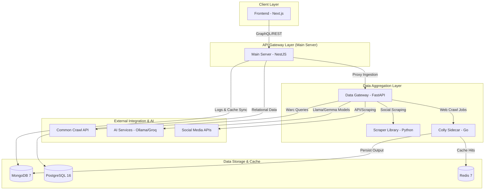

# PakSentiment

> **DataInsight**: A comprehensive, high-performance social media sentiment analysis platform.

[](https://opensource.org/licenses/MIT)
[](https://www.python.org/downloads/)
[](https://nodejs.org/)
[](https://golang.org/)
[](https://nestjs.com/)
[](https://fastapi.tiangolo.com/)

**Final Year Project (FYP) — Department of Creative Technologies, AIR University**

---

## 📋 Table of Contents

- [Overview](#-overview)
- [Key Features](#-key-features)
- [System Architecture](#-system-architecture)
- [Tech Stack](#-tech-stack)
- [Database Architecture (Dual Setup)](#-database-architecture-dual-setup)
- [Project Directory Structure](#-project-directory-structure)
- [Getting Started](#-getting-started)
  - [Prerequisites](#prerequisites)
  - [Local Development Setup](#local-development-setup)
  - [Dockerized Deployment](#dockerized-deployment)
- [API & Swagger Documentation](#-api--swagger-documentation)
- [Project Wiki & Reference Guides](#-project-wiki--reference-guides)
- [Project Team](#-project-team)
- [License](#-license)

---

## 🎯 Overview

**PakSentiment** (codenamed **DataInsight**) is an end-to-end, multi-tier social media scraper and sentiment analysis platform. It allows researchers, marketers, and developers to analyze public opinion across multiple sources (Reddit, Twitter/X, YouTube, web pages, RSS feeds, NewsAPI, and Common Crawl) using local and cloud-based Large Language Models (LLMs) and traditional NLP classification engines.

The platform employs a robust microservices architecture consisting of a **Next.js Frontend**, a **NestJS API Orchestrator (Main Server)**, a **FastAPI Data Gateway**, and a **Go Colly Sidecar** for high-throughput stealth crawling.

---

## ✨ Key Features

### 📡 High-Throughput Scrapers & Integrations
*   **Reddit Scaling Engine**: Dual-mode extraction:
    *   *Free Tier*: Uses standard public RSS feeds (no authentication or proxy overhead required).
    *   *Paid Tier*: Utilizes JSON API scraping combined with rotated proxies for rich historical metadata.
*   **YouTube Scraping**: Extracts video metadata, top comments, and retrieves transcripts for deep analysis.
*   **Web Scraping & Crawling**: Uses **Scrapling** (stealth browser scraping) with a high-performance **Go Colly Sidecar** for parallel page extraction.
*   **RSS & NewsAPI Integration**: Collects articles and trends from global news sources via custom RSS feeds and the NewsAPI service.
*   **Other Platforms**: Pulls data from Stack Overflow, Hacker News, GDELT, Mastodon, and Google Trends.
*   **Common Crawl**: Integrates with historical Common Crawl index queries.

### 🧠 Sentiment & Topic Analytics
*   **AI Sentiment Engine**: Leverages Ollama (local LLM inference), Groq (cloud LLM APIs), and Hugging Face pre-trained models to classify content (Positive, Negative, Neutral) with confidence metrics.
*   **Urdu & English Analysis**: Automatic language detection and translation capabilities supporting both Roman Urdu, Urdu script, and English.
*   **Smart Search**: AI-driven planner that parses user queries and drafts a multi-source extraction plan.
*   **Fuzzy Cache Normalization**: Token-based Redis caching that returns instant sentiment stats for repeated or structurally similar queries.

### 🔐 User & Subscription Management
*   **Role-Based Access Control (RBAC)**: Users are partitioned by Role (`free`, `premium`, `admin`) and Subscription Tier (`free`, `premium`, `super_premium`).
*   **JSON Web Tokens (JWT)**: Security middleware enforcing token validation on API layers.
*   **Dashboard Command Center**: Pulse charts, KPI statistics (Lifetime Analyses, Unique Authors, Top Sentiment Topics), and recent search replays.

---

## 🏗️ System Architecture



---

## 🛠️ Tech Stack

*   **Frontend**: Next.js 14+ (App Router), React 18+, Tailwind CSS, Recharts, Framer Motion.
*   **Main Server**: NestJS, TypeScript, TypeORM, Passport.js (JWT, Google OAuth), Swagger UI.
*   **Data Gateway**: FastAPI, Python 3.12+, Pydantic, Dynaconf, Scrapling, Trafilatura, jusText.
*   **Colly Sidecar**: Go 1.21+, Gin, Colly (high-speed crawler), go-readability.
*   **Databases & Caches**:
    *   **PostgreSQL 16**: User credentials, identity providers, and API keys.
    *   **MongoDB 7**: Crawl jobs, scraped documents, system logs, session data, and analytics cache.
    *   **Redis 7**: Scraped page cache and fuzzy text lookup keys.

---

## 🗄️ Database Architecture (Dual Setup)

The application utilizes a **hybrid database model** to handle core relational operations and heavy document storage separately. Check out the implementation in the main [AppModule](file:///Users/mrgoblin/workspace/uni/fyp/new_current/main-server/src/app.module.ts).

### Relational Schema (PostgreSQL)
Manages user accounts, authentication methods, configurations, and API keys:
1.  **[UserEntity](file:///Users/mrgoblin/workspace/uni/fyp/new_current/main-server/src/database/entities/user.entity.ts) (`users`)**: Handles profile info, user state, system role, and billing status.
2.  **[IdentityEntity](file:///Users/mrgoblin/workspace/uni/fyp/new_current/main-server/src/database/entities/identity.entity.ts) (`identities`)**: Coordinates login credentials for local and OAuth (Google, GitHub) providers.
3.  **[UserPreferenceEntity](file:///Users/mrgoblin/workspace/uni/fyp/new_current/main-server/src/database/entities/user-preference.entity.ts) (`user_preferences`)**: UI themes and default dashboard platforms.
4.  **[ApiKeyEntity](file:///Users/mrgoblin/workspace/uni/fyp/new_current/main-server/src/database/entities/api-key.entity.ts) (`api_keys`)**: Access tokens generated for custom API integration.
5.  **[UserActivityEntity](file:///Users/mrgoblin/workspace/uni/fyp/new_current/main-server/src/database/entities/user-activity.entity.ts) (`user_activities`)**: System event logs mapping back to user IDs.
6.  **[SystemConfigEntity](file:///Users/mrgoblin/workspace/uni/fyp/new_current/main-server/src/database/entities/system-config.entity.ts) (`system_configs`)**: System-wide feature toggles.

### Document Schema (MongoDB)
Stores high-volume scraped posts, analytical models, and crawlers outputs:
1.  **[ScrapedDocumentEntity](file:///Users/mrgoblin/workspace/uni/fyp/new_current/main-server/src/database/entities/mongo/scraped-document.entity.ts) (`scraped_documents`)**: Extracted text fragments, cleaning methods (`justext`/`trafilatura`), and sentiment confidence scores.
2.  **[CrawlJobEntity](file:///Users/mrgoblin/workspace/uni/fyp/new_current/main-server/src/database/entities/mongo/crawl-job.entity.ts) (`crawl_jobs`)**: Crawler batch tracking containing scraped URLs, titles, and cached web states.
3.  **[AnalysisSessionEntity](file:///Users/mrgoblin/workspace/uni/fyp/new_current/main-server/src/database/entities/mongo/analysis-session.entity.ts) (`analysis_sessions`)**: Groups a list of MongoDB document IDs analyzed under a user query.
4.  **[AnalyticsCacheEntity](file:///Users/mrgoblin/workspace/uni/fyp/new_current/main-server/src/database/entities/mongo/analytics-cache.entity.ts) (`analytics_cache`)**: Cached positive/negative/neutral ratios and keyword frequencies.
5.  **[SystemLogEntity](file:///Users/mrgoblin/workspace/uni/fyp/new_current/main-server/src/database/entities/mongo/system-log.entity.ts) (`system_logs`)**: Centralized error reporting and component logs.

---

## 📁 Project Directory Structure

```
paksentiment/
├── frontend/                      # Next.js 14 Web Application
│   ├── src/app/                   # App Router Layouts, Pages, and Styling
│   ├── src/components/            # Dashboard Analytics & Charts
│   └── Dockerfile
│
├── main-server/                   # NestJS API Orchestrator (Main Server)
│   ├── src/database/              # TypeORM Entities (Postgres & MongoDB Models)
│   ├── src/modules/               # Auth, Activity, Payments, and Raw Data Modules
│   └── Dockerfile
│
├── new PakSentiment-data-gateway/ # FastAPI Data Ingestion Gateway
│   ├── services/                  # Reddit, Scrapling, YouTube, and AI connectors
│   ├── config/                    # API credentials (secrets.toml)
│   └── Dockerfile
│
├── colly-sidecar/                 # Go High-Performance Web Crawler
│   ├── cmd/                       # Entry point main.go
│   ├── crawler/                   # Colly spider pipelines and content cleaners
│   └── Dockerfile
│
├── PakSentiment-scraper/          # Shared Python Scraper Engine SDK
│   └── src/paksentiment_scraper/  # Library models and service integrations
│
├── architecture/                  # Class diagrams and system schema diagrams
├── docs/                          # In-depth architectural designs & proposals
└── Project WIKI.md               # Detailed system manuals & reference documentation
```

---

## 🚀 Getting Started

### Prerequisites
Make sure you have installed:
*   **Node.js** v18 or later
*   **Python** 3.12+ (Astral `uv` is recommended)
*   **Go** 1.21+
*   **Docker** & **Docker Compose**
*   **Ollama** (for local LLM execution: `ollama run llama3`)

---

### Local Development Setup

#### 1. Clone the Repository
```bash
git clone https://github.com/MRGLOBIN/FYP-Paksentiment.git
cd FYP-Paksentiment
```

#### 2. Configuration Setup
Create local configurations from sample files:
```bash
# Root docker config
cp .env.docker.example .env.docker

# Main Server (NestJS)
cp main-server/.env.example main-server/.env

# Frontend (Next.js)
cp frontend/.env.example frontend/.env
```

Configure your credentials inside `main-server/.env`:
```env
PORT=3000
NODE_ENV=development
POSTGRES_HOST=localhost
POSTGRES_PORT=5432
POSTGRES_USER=postgres
POSTGRES_PASSWORD=postgres
POSTGRES_DB=paksentiment
MONGO_URI=mongodb://localhost:27017
MONGO_DB=paksentiment
REDIS_URL=redis://localhost:6379
FAST_API_BASE_URL=http://localhost:8000
COLLY_SIDECAR_URL=http://localhost:8081
OLLAMA_URL=http://localhost:11434
JWT_SECRET=your_secret_key
JWT_EXPIRES_IN=1h
```

Configure data API credentials in `new PakSentiment-data-gateway/config/.secrets.toml`:
```toml
[default]
YOUTUBE_API_KEY = "your_youtube_api_key"
REDDIT_CLIENT_ID = "your_reddit_client_id"
REDDIT_CLIENT_SECRET = "your_reddit_client_secret"
TWITTER_BEARER_TOKEN = "your_twitter_bearer_token"
```

#### 3. Install Dependencies
```bash
# Next.js Frontend
cd frontend && npm install && cd ..

# NestJS Main Server
cd main-server && npm install && cd ..

# Python Data Gateway & Scraper SDK (using uv)
curl -LsSf https://astral.sh/uv/install.sh | sh
uv sync

# Go Crawler
cd colly-sidecar && go mod tidy && cd ..
```

#### 4. Spin up Local Databases (PostgreSQL, MongoDB, Redis)
Using Docker Compose:
```bash
docker-compose up postgres mongo redis -d
```

#### 5. Launch Application services

*   **Terminal 1 - FastAPI Gateway**:
    ```bash
    cd "new PakSentiment-data-gateway"
    uv run uvicorn main:app --reload --port 8000
    ```
*   **Terminal 2 - Go Crawler Sidecar**:
    ```bash
    cd colly-sidecar
    go run main.go
    ```
*   **Terminal 3 - NestJS Orchestrator**:
    ```bash
    cd main-server
    npm run start:dev
    ```
*   **Terminal 4 - Next.js Dashboard**:
    ```bash
    cd frontend
    npm run dev
    ```

You can access the UI at `http://localhost:3001` and interactive Swagger docs at `http://localhost:3000/api`.

---

### Dockerized Deployment

To spin up the entire cluster (Frontend, Backend servers, Data Gateways, Databases, Caches) with a single command:

```bash
# Build and run all services
docker-compose up --build -d

# Check cluster logs
docker-compose logs -f

# Terminate cluster
docker-compose down
```

#### Network Ports in Docker Setup
*   **Frontend UI**: http://localhost:5001
*   **Main Server (NestJS)**: http://localhost:5002
*   **Data Gateway (FastAPI)**: http://localhost:5003
*   **Colly Sidecar (Go)**: http://localhost:5004
*   **PostgreSQL**: `localhost:5005`
*   **MongoDB**: `localhost:5006`
*   **Redis**: `localhost:5007`

---

## 📖 API & Swagger Documentation

The NestJS gateway features interactive **Swagger/OpenAPI** specs mapping all analytical and user endpoints:

*   **Local URL**: [http://localhost:3000/api](http://localhost:3000/api)
*   **Dockerized URL**: [http://localhost:5002/api](http://localhost:5002/api)

> [!IMPORTANT]
> To execute data analysis endpoints, sign up or log in first. Obtain a JWT token from `/auth/login-with-email-password` or `/auth/google` and authorize Swagger using the header:
> `Authorization: Bearer <your_jwt_token>`

---

## 📚 Project Wiki & Reference Guides

For in-depth architectural and developer guidelines, read the local resources:
*   **[Project WIKI](./Project%20WIKI.md)**: Details the complete implementation history, modules configuration, database design, and pipeline details.
*   **[Architecture Diagrams](./architecture/)**: Technical UML files, class hierarchies, and entity schemas.
*   **[Scraper SDK Documentation](./PakSentiment-scraper/README.md)**: Guide on how to consume the Python Scraping library independently.
*   **[Go Crawler Details](./colly-sidecar/README.md)**: Sidecar REST endpoints and cache implementation details.

---

## 👥 Project Team

This system was designed and implemented for a **Final Year Project (FYP)** in Computer Science at **AIR University**:

*   **Team Lead & Backend Developer**: Muhammad Asim ([GitHub](https://github.com/MRGLOBIN)) — *Email: asimqwe2@gmail.com*
*   **Team Members / Contributors**: `[Team Member Names / Contact Info]`
*   **Project Supervisor**: `[Supervisor Name / Contact Info]`

---

## 📄 License

This repository is licensed under the **MIT License**. Check out the [LICENSE](LICENSE) file for complete details.

---

<div align="center">
  <sub>Built with ❤️ by the AIR University FYP Team</sub>
</div>
