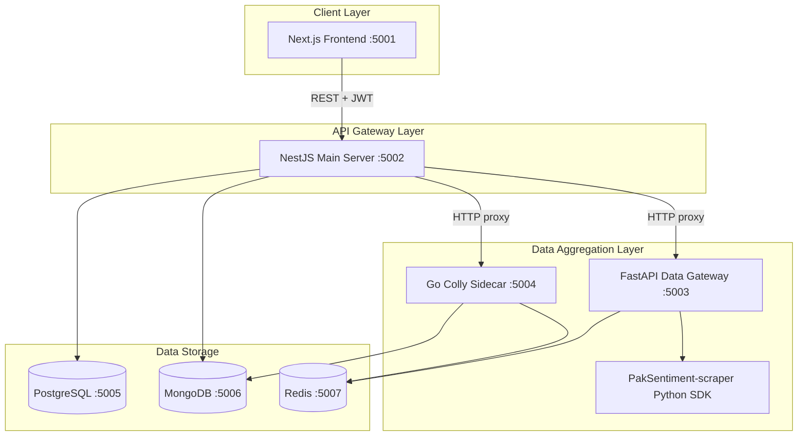

# 02 — Project Overview

## 2.1 Summary

**PakSentiment** is an end-to-end social media scraper and sentiment analysis platform. Users register, authenticate with JWT, run analyses across Reddit, YouTube, web pages, and news integrations, and view dashboards with sentiment charts and KPIs. Subscription tiers (`free`, `premium`, `super_premium`) control access to richer data sources (e.g. Reddit JSON+proxy vs RSS).

## 2.2 System architecture

## 2.3 Component responsibilities

| Component | Path | Role |
|-----------|------|------|
| **Frontend** | `frontend/` | Dashboard, analytics, auth UI, Stripe/PayPal checkout UI |
| **Main server** | `main-server/` | JWT auth, RBAC/tier logic, proxies to gateway/sidecar, payments, Swagger |
| **Data gateway** | `new PakSentiment-data-gateway/` | Reddit/YouTube/Common Crawl/Scrapling, sentiment (Groq/local model) |
| **Colly sidecar** | `colly-sidecar/` | High-throughput web crawl, NewsAPI/GDELT/RSS integrations |
| **Scraper SDK** | `PakSentiment-scraper/` | Shared Python clients for social platforms |

## 2.4 Data flow (typical analysis)

1. User logs in via `/auth/login-with-email-password` or Google OAuth → receives JWT.
2. Frontend stores JWT in **localStorage** (Zustand persist) and sends `Authorization: Bearer` on API calls.
3. User submits analysis (e.g. Reddit subreddit) → `POST /raw-data/reddit` on NestJS.
4. NestJS validates JWT, resolves user tier, proxies to FastAPI (`FAST_API_BASE_URL`).
5. Gateway scrapes data, optionally runs sentiment; results stored in MongoDB via Nest providers.
6. Frontend polls `GET /raw-data/session/:sessionId` and renders charts.

## 2.5 Trust boundaries

| Boundary | Trust assumption | Risk if violated |
|----------|------------------|------------------|
| Internet → Frontend | Public | XSS, token theft |
| Frontend → NestJS | JWT proves identity | Forged/stolen JWT |
| NestJS → FastAPI/Colly | **Implicit trust (no mTLS/API key)** | Direct gateway abuse |
| NestJS → Databases | Connection strings | Exposed DB ports |
| NestJS → Stripe | Secret key server-side | Payment bypass |

## 2.6 Functional overview (original FYP)

### User management
- Registration with password policy validation
- Email/password and Google OAuth login
- Roles: `free`, `premium`, `admin`; subscription tiers: `free`, `premium`, `super_premium`

### Analytics
- Reddit, YouTube, web/scrapling, Common Crawl, smart search (AI planner)
- Sentiment via Groq, Ollama, or local Hugging Face classifier
- Urdu/English translation endpoints

### Dashboard
- Pulse charts, lifetime analyses, recent sessions
- Tier-gated Reddit scaling (RSS vs JSON+proxy)

### Payments
- Stripe PaymentIntents for subscription plans
- Client-side Stripe Elements in `PaymentModal.tsx`

## 2.7 Security controls already present

| Control | Location |
|---------|----------|
| bcrypt password hashing | `auth.service.ts` |
| Global `ValidationPipe` (whitelist, forbid extra fields) | `main.ts` |
| CORS allowlist | `main.ts` |
| Google ID token verification | `auth.service.ts` |
| JWT on protected `/raw-data`, `/crawler`, `/ai`, `/activity` | Controllers + `AuthGuard` |
| TypeORM parameterized queries (no raw SQL in request path) | Entities / repositories |

## 2.8 Documentation references

- [Readme.md](../Readme.md) — setup and architecture
- [Project WIKI.md](../Project%20WIKI.md) — implementation manual
- [docs/knowledge_base/architecture.md](../docs/knowledge_base/architecture.md)

## 2.9 Assessment focus areas

Given the architecture, the highest-risk surfaces are:

1. **Unauthenticated internal services** (ports 5003, 5004)
2. **Open image proxy** on NestJS
3. **Payment tier escalation** without payment verification
4. **Docker misconfiguration** (exposed databases, default secrets)

See [04-vulnerability-assessment-results.md](04-vulnerability-assessment-results.md) for detailed findings.
