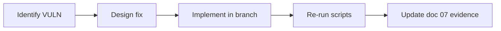

# 06 — Patch Implementation Process (Planned)

> **Status:** This phase documents **planned** mitigations only. No application code was modified during the assessment report phase. Implementation is scheduled for a follow-up branch.

## 6.1 Process overview

| Step | Action |
|------|--------|
| 1 | Branch `security/hardening` from main |
| 2 | Implement fixes per priority table below |
| 3 | Re-run `analysis/scripts/run-all.sh` |
| 4 | Update [07-before-after-comparison.md](07-before-after-comparison.md) with live results |
| 5 | Capture viva screenshots |

## 6.2 Planned mitigations by vulnerability

### VULN-01 — Open proxy

| Item | Detail |
|------|--------|
| **Files** | `proxy.controller.ts` |
| **Changes** | Add `@UseGuards(AuthGuard)`; validate URL scheme `https` only; allowlist hosts (`i.redd.it`, `preview.redd.it`, `ytimg.com`, etc.); reject private IP ranges (RFC1918, 169.254.0.0/16, localhost) using `ipaddr.js` or similar |
| **Test** | `02-test-open-proxy.sh` should return 401 without JWT, 403 for metadata URL |

### VULN-02 — Payment escalation

| Item | Detail |
|------|--------|
| **Files** | `payments.controller.ts`, `payments.service.ts`, new `stripe.webhook.controller.ts` |
| **Changes** | Remove client-triggered tier upgrade; add `POST /payments/webhook` with Stripe signature verification; on `payment_intent.succeeded`, read `metadata.planName` and update tier; `fulfill-subscription` deprecated or requires `paymentIntentId` verified via Stripe API |
| **Test** | `03-test-payment-escalation.sh` — fulfill without payment returns 403 |

### VULN-03 — create-intent

| Item | Detail |
|------|--------|
| **Changes** | `@UseGuards(AuthGuard)` on `create-intent`; bind `PaymentIntent` metadata to `userId` |
| **Test** | Unauthenticated POST returns 401 |

### VULN-04 / VULN-05 — Internal APIs

| Item | Detail |
|------|--------|
| **Files** | `main.py` (FastAPI middleware), `colly-sidecar/cmd/router.go`, Nest axios clients |
| **Changes** | Env `INTERNAL_API_KEY`; middleware checks `X-Internal-Api-Key` on gateway/sidecar; docker-compose: **do not publish** 5003/5004 to host in production profile; Nest passes key on all proxy requests |
| **Tier** | Remove public `tier` query param; gateway reads tier from Nest-injected header `X-User-Tier` |

### VULN-06 — Docker misconfiguration

| Item | Detail |
|------|--------|
| **Files** | `docker-compose.yml`, `.env.docker.example` |
| **Changes** | Remove host port mappings for postgres/mongo/redis in prod overlay; enable MongoDB auth, Redis `requirepass`; fail startup if `JWT_SECRET` is default |

### VULN-07 — JWT config

| Item | Detail |
|------|--------|
| **Files** | `auth.module.ts`, `main.ts` bootstrap |
| **Changes** | Throw if `JWT_SECRET` missing or equals known weak values; use `configService.get('JWT_EXPIRES_IN')` in signOptions |

### VULN-08 — localStorage

| Item | Detail |
|------|--------|
| **Files** | `useAuthStore.ts`, Nest auth (httpOnly cookie option) |
| **Changes** | (Larger) httpOnly `Secure` `SameSite=Strict` cookie for refresh/access; or short-lived access token in memory + refresh cookie |
| **Alternative (smaller)** | Document CSP headers; sanitize all user-rendered content |

### VULN-09 — synchronize

| Item | Detail |
|------|--------|
| **Files** | `app.module.ts` |
| **Changes** | `synchronize: process.env.NODE_ENV !== 'production'`; add TypeORM migrations |

### VULN-10 — HTTP hardening

| Item | Detail |
|------|--------|
| **Files** | `main.ts`, `package.json` |
| **Changes** | `app.use(helmet())`; register `ThrottlerModule` (e.g. 100 req/min per IP on `/auth`) |

### VULN-11 — URL validation

| Item | Detail |
|------|--------|
| **Files** | Crawl DTOs, gateway scrapling routes |
| **Changes** | `@IsUrl()`, custom validator blocking private IPs; max URL length |

### VULN-12 — Documentation

| Item | Detail |
|------|--------|
| **Files** | `Readme.md` |
| **Changes** | Remove GraphQL/Passport claims; document actual JWT + REST stack |

## 6.3 Implementation checklist (future)

- [ ] VULN-02 Stripe webhook + remove unsafe fulfill
- [ ] VULN-01 Proxy allowlist + auth
- [ ] VULN-04/05 Internal API key + network isolation
- [ ] VULN-06 Docker prod profile
- [ ] VULN-03 Auth on create-intent
- [ ] VULN-07/09/10 Config and hardening
- [ ] VULN-08 Session strategy (or CSP)
- [ ] VULN-11 URL validators
- [ ] VULN-12 README update

## 6.4 Verification criteria

A patch is accepted when:

1. Relevant `analysis/scripts/*.sh` shows expected HTTP status change
2. No regression in `tests/e2e-tests.sh` (if Ollama available)
3. Manual smoke: login → Reddit analysis → payment flow (Stripe test mode)

## 6.5 Rollback plan

- Keep Docker images tagged pre-hardening
- Feature-flag `INTERNAL_API_KEY` requirement during migration
- Database migrations reversible where possible
