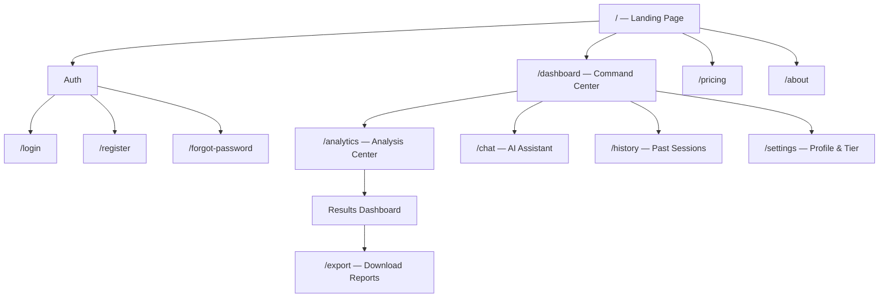
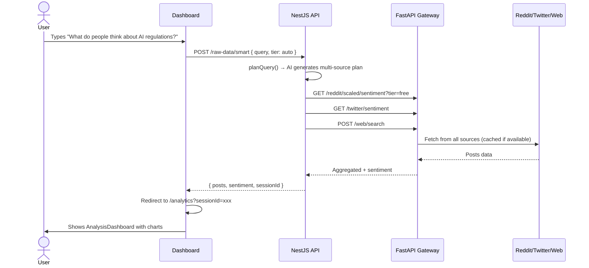

# DataInsight — Frontend Design & UI Blueprint

> A comprehensive design document for the DataInsight social analytics platform.
> Covers information architecture, user workflows, color system, component design, and page-by-page specifications.

---

## 1. Product Vision & Positioning

DataInsight sits between **Sprout Social** (simple, action-oriented) and **Brandwatch** (deep analytical). Our sweet spot:

> **Instant intelligence for non-analysts** — A user types a natural language question, AI figures out where to search, and results appear as beautiful, actionable visualizations.

### Core Differentiator
Most tools force users to pick sources, write queries, configure filters. DataInsight's **AI Smart Search** does that automatically. The user just asks a question.

---

## 2. Information Architecture



### Current Routes (What You Have)
| Route | Status | Notes |
|---|---|---|
| `/` | ✅ Exists | Landing page with Hero, Features, CTA |
| `/login`, `/register` | ✅ Exists | Auth flows working |
| `/dashboard` | ⚠️ Basic | Only shows activity log — needs major upgrade |
| `/analytics` | ✅ Good | Source selector + analysis + results dashboard |
| `/chat` | ✅ Exists | AI chat assistant |
| `/pricing` | ✅ Exists | 3-tier pricing with Stripe |
| `/about` | ✅ Exists | About page |

### Proposed New/Upgraded Routes
| Route | Priority | Purpose |
|---|---|---|
| `/dashboard` | 🔴 Critical | **Complete redesign** — becomes the command center |
| `/history` | 🟡 Medium | Dedicated session browser with replay |
| `/settings` | 🟢 Nice-to-have | Profile, subscription, API keys |

---

## 3. Color System

### Philosophy
Your existing palette is already solid — emerald green primary (`#10b981`) with indigo accent (`#6366f1`) on a clean light/dark surface system. **Don't change it.** Instead, extend it with **source-specific semantic colors** that are already partially in your analytics page.

### Extended Palette

#### Brand Colors (Keep As-Is)
| Token | Light | Dark | Usage |
|---|---|---|---|
| `--primary` | `#10b981` | `#10b981` | CTAs, success states, positive sentiment |
| `--primary-dark` | `#059669` | `#059669` | Hover states, active elements |
| `--accent` | `#6366f1` | `#818cf8` | Secondary actions, AI features |

#### Source-Specific Colors (New)
| Source | Color | Hex | Usage |
|---|---|---|---|
| Reddit | Orange-Red | `#FF4500` | Reddit badges, charts, source indicators |
| Twitter/X | Electric Blue | `#1DA1F2` | Twitter source badges and charts |
| Web Scrape | Emerald | `#10b981` | Web source (matches brand) |
| Web History | Purple | `#8B5CF6` | CommonCrawl archival data |
| AI Smart Search | Amber | `#EAB308` | AI-generated results |
| YouTube | Red | `#FF0000` | YouTube source data |

#### Sentiment Colors (Critical for Charts)
| Sentiment | Color | Hex | Notes |
|---|---|---|---|
| Positive | Emerald | `#10b981` | Matches brand primary |
| Negative | Rose | `#f43f5e` | Softer than pure red, easier on dark backgrounds |
| Neutral | Slate | `#94a3b8` | Low visual weight, recedes in charts |
| Mixed | Amber | `#f59e0b` | For ambiguous/mixed sentiment |

#### Tier Badge Colors
| Tier | Color | Style |
|---|---|---|
| Free | `#94a3b8` (Slate) | Solid muted badge |
| Premium | `#6366f1` (Indigo) | Gradient badge with subtle glow |
| Super Premium | `#f59e0b → #ef4444` (Amber→Rose) | Gradient badge with animated shimmer |

### Dark Mode (Default Recommendation)
For a data analytics tool, **dark mode should be the default**. Users stare at dashboards for long periods. Your existing dark palette is excellent:

```
Background:     #0c0f17  (deep navy-black)
Surface/Card:   #161b2e  (elevated card)
Card Hover:     #1c2340  (subtle lift)
Border:         #232d46  (low contrast divider)
```

> [!TIP]
> Consider making dark mode the default for logged-in users. The landing page can stay light-mode to feel inviting and marketing-friendly, then transition to dark when they enter the dashboard.

---

## 4. Dashboard Redesign — The Command Center

The current `/dashboard` only shows an activity log. It should be the **nerve center** of the app.

### Layout

```
┌──────────────────────────────────────────────────────────────┐
│  Navbar (logo, nav, user avatar + tier badge, theme toggle)  │
├──────────────────────────────────────────────────────────────┤
│                                                              │
│  ┌─ Welcome Header ─────────────────────────────────────┐   │
│  │  Good morning, Hamza.           [Premium Badge]       │   │
│  │  ┌─────────────────────────────────────────────┐     │   │
│  │  │  🔍  "What's the public opinion on..."      │     │   │
│  │  │       [AI Smart Search Bar]         [Search] │     │   │
│  │  └─────────────────────────────────────────────┘     │   │
│  └───────────────────────────────────────────────────────┘   │
│                                                              │
│  ┌─ Quick Stats Row ────────────────────────────────────┐   │
│  │ [Total Analyses] [Posts Analyzed] [Active Sources] [Tier] │
│  └───────────────────────────────────────────────────────┘   │
│                                                              │
│  ┌─ Two-Column Layout ──────────────────────────────────┐   │
│  │                              │                        │   │
│  │  Recent Sessions             │  Trending / Live Feed  │   │
│  │  ├─ Session Card             │  ├─ Topic bubble       │   │
│  │  ├─ Session Card             │  ├─ Topic bubble       │   │
│  │  └─ Session Card             │  └─ Topic bubble       │   │
│  │                              │                        │   │
│  │  [View All History]          │  Sentiment Over Time   │   │
│  │                              │  (sparkline chart)     │   │
│  └──────────────────────────────┴────────────────────────┘   │
│                                                              │
│  ┌─ Quick Access Cards ─────────────────────────────────┐   │
│  │ [Reddit]  [Twitter]  [Web Scrape]  [AI Chat]  [Docs]  │   │
│  └───────────────────────────────────────────────────────┘   │
│                                                              │
└──────────────────────────────────────────────────────────────┘
```

### Key Components

#### 1. AI Smart Search Bar (Hero Element)
The most prominent element on the dashboard. A single large input where the user types a natural language question. This is the **primary entry point** for all analysis.

- Centered, large, with a subtle glow animation on focus
- Placeholder cycles through examples: *"What do people think about...", "Sentiment on...", "Find news about..."*
- Auto-submits to the existing `POST /raw-data/smart` endpoint
- Results redirect to `/analytics?sessionId=...`

#### 2. Quick Stats Cards
Four summary metric cards in a horizontal row:
- **Total Analyses** — lifetime count from activity log
- **Posts Analyzed** — total across all sessions
- **Active Sources** — how many source types the user has used
- **Current Tier** — with upgrade CTA for free users

#### 3. Recent Sessions (Left Column)
Cards showing the last 5 analysis sessions with:
- Query text
- Source badge (Reddit/Twitter/AI)
- Post count & dominant sentiment (color-coded pill)
- Timestamp
- Click → navigates to `/analytics?sessionId=...`

#### 4. Quick Access Cards
Grid of source shortcuts that deep-link to `/analytics?source=reddit_sentiment`, etc.

---

## 5. User Workflows

### Workflow A: AI Smart Search (Primary — 70% of usage)



### Workflow B: Source-Specific Search (Power Users — 25%)

1. User clicks a source card (e.g., "Reddit Sentiment")
2. Redirected to `/analytics?source=reddit_sentiment`
3. Enters subreddit + query manually
4. Clicks "Run Analysis"
5. Results appear in the same AnalysisDashboard

### Workflow C: Session Replay (Returning Users — 5%)

1. User visits `/dashboard`
2. Sees recent sessions in the left column
3. Clicks a session → `/analytics?sessionId=...`
4. Full cached results load instantly from MongoDB

---

## 6. Analysis Results Dashboard — Component Design

The existing `AnalysisDashboard` component is good but should be enhanced:

### Data Visualization Cards

#### Sentiment Distribution (Donut Chart)
- Large centered donut showing Positive / Negative / Neutral / Mixed
- Animated on mount (ring draws itself)
- Center shows dominant sentiment label + percentage
- Colors: `#10b981` / `#f43f5e` / `#94a3b8` / `#f59e0b`

#### Sentiment Over Time (Area Chart)
- If posts have timestamps, show a stacked area chart
- X-axis: time, Y-axis: sentiment count
- Smooth gradient fills under each sentiment line
- Hover to see exact values

#### Source Breakdown (Horizontal Bar)
- Shows how many posts came from each source
- Color-coded by source color
- Click to filter the post list below

#### Post Feed (Scrollable List)
- Each post card shows:
  - Source icon + badge
  - Title (truncated)
  - Excerpt (first 100 chars)
  - Sentiment pill (color-coded)
  - Confidence percentage (subtle)
  - Author + timestamp
- Click to expand full text
- Filter bar: sentiment filter, source filter, search within results

#### Word Cloud / Topic Clusters (Premium Feature)
- Visual word cloud generated from post titles
- Size = frequency, color = average sentiment
- Gated behind paid tier — show blurred preview for free users with "Upgrade to unlock" overlay

---

## 7. Tier-Aware UI Behavior

### Free Tier
| Element | Behavior |
|---|---|
| Search Bar | Works, routes through RSS |
| Source Cards | Reddit + Twitter available. Web + CommonCrawl show lock icon |
| Results | Basic sentiment breakdown (donut + post list) |
| Exports | Disabled with "Upgrade" tooltip |
| AI Chat | Limited to 10 messages/day (show counter) |
| Word Cloud | Blurred with upgrade overlay |

### Premium Tier
| Element | Behavior |
|---|---|
| Search Bar | Routes through JSON + proxy (richer data) |
| Source Cards | All sources unlocked |
| Results | Full charts including area chart + word cloud |
| Exports | CSV + PDF enabled |
| AI Chat | Unlimited |
| Badge | Indigo gradient badge next to username |

### Super Premium
| Element | Behavior |
|---|---|
| Everything Premium | ✅ |
| API Access | Show API key management section in settings |
| Team Features | Collaboration UI |
| Badge | Animated gold shimmer badge |

### Implementation Approach
Add a `<TierGate tier="premium">` wrapper component:
```tsx
// Usage
<TierGate requiredTier="premium" fallback={<UpgradeOverlay />}>
  <WordCloudChart data={data} />
</TierGate>
```

---

## 8. Micro-Interactions & Animations

### Critical Animations
| Element | Animation | Timing |
|---|---|---|
| Search bar focus | Subtle green glow pulse | `350ms ease` |
| Source cards | Scale up 1.02 + shadow lift on hover | `200ms ease` |
| Donut chart | Ring draws clockwise on mount | `800ms ease-out` |
| Sentiment pills | Fade-in + slide-up staggered | `150ms * index` |
| Session cards | Slide-in from left on load | `300ms spring` |
| Loading state | Pulsing skeleton screens (not spinners) | Continuous |
| Tier badge | Premium: gentle shimmer / Super: animated gradient | `2s linear infinite` |
| Page transitions | Fade + subtle Y translate | `250ms ease` |

### Loading States
**Never use spinners.** Use skeleton screens that match the shape of the content:
- Search results → skeleton post cards
- Charts → skeleton chart shapes with pulse animation
- Stats → skeleton number blocks

---

## 9. Typography

Your existing system is already excellent. Keep:
- **Inter** for all UI text
- **JetBrains Mono** for data values, code snippets, API keys

Specific usage recommendations:
| Element | Weight | Size |
|---|---|---|
| Dashboard greeting | 700 (Bold) | `--font-size-3xl` (1.875rem) |
| Card titles | 600 (Semibold) | `--font-size-lg` (1.125rem) |
| Body text | 400 (Regular) | `--font-size-base` (0.9375rem) |
| Stat numbers | 800 (Extra-bold) | `--font-size-4xl` (2.25rem) |
| Data values in charts | 500 Mono | `--font-size-sm` (0.8125rem) |
| Captions / metadata | 400 | `--font-size-xs` (0.75rem) |

---

## 10. Responsive Strategy

| Breakpoint | Layout |
|---|---|
| **≥1200px** (Desktop) | Two-column dashboard, full chart suite |
| **768–1199px** (Tablet) | Single-column, charts stack vertically |
| **<768px** (Mobile) | Bottom navigation, collapsible source selector, vertical card feed |

### Mobile-Specific
- Search bar becomes full-width with floating action button
- Source selector becomes a horizontally scrollable pill bar
- Charts resize to single-column with swipe between them
- Bottom nav: Home / Analyze / Chat / Profile

---

## 11. Technology Recommendations

### Keep
- **Next.js** (App Router) — already working well
- **SCSS Modules** — scoped styles, matches your existing patterns
- **MUI Icons** — already imported, good icon library
- **Zustand** — lightweight state management already in place

### Add
| Library | Purpose | Why |
|---|---|---|
| `recharts` | Charts (donut, area, bar) | Lightweight, React-native, great dark mode support |
| `framer-motion` | Micro-animations | Page transitions, card stagger, chart mount animations |
| `react-hot-toast` | Toast notifications | For cache hit indicators, analysis complete alerts |
| `date-fns` | Date formatting | Lightweight, tree-shakeable, for "2 hours ago" timestamps |

### Don't Add
- ❌ TailwindCSS — you already have a comprehensive CSS design system
- ❌ D3.js — too heavy for your needs, recharts covers everything
- ❌ Redux — overkill, Zustand is perfect for this scale

---

## 12. Summary — Priority Implementation Order

| Priority | What | Impact |
|---|---|---|
| 🔴 P0 | Dashboard redesign (smart search bar + stats + sessions) | Makes the app feel alive and premium |
| 🔴 P0 | Skeleton loading screens | Eliminates the "Loading..." text, feels professional |
| 🟡 P1 | Enhanced charts (donut + area) with recharts | Dramatically improves data presentation |
| 🟡 P1 | Tier badges + TierGate component | Enforces business model visually |
| 🟡 P1 | Source-colored post cards in results | Visual differentiation of data sources |
| 🟢 P2 | Micro-animations with framer-motion | Polish and delight |
| 🟢 P2 | History page with session replay | Retention feature |
| 🟢 P2 | Export functionality (CSV/PDF) | Premium monetization driver |
